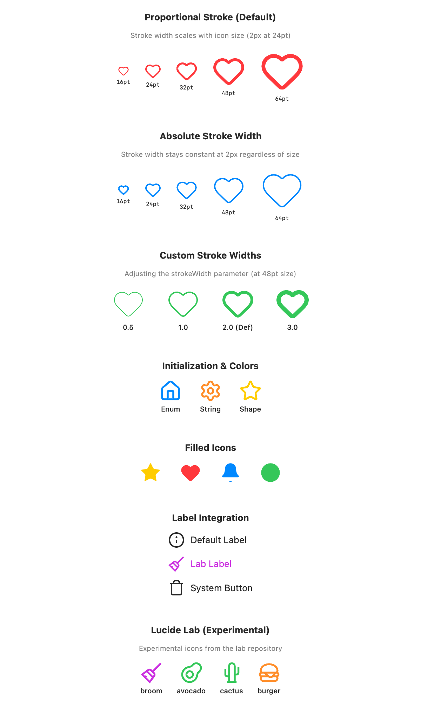

<p align="center">
  <a href="https://swift.org"></a>
  <a href="https://developer.apple.com/swiftui/"></a>
  <a href="LICENSE"></a>
  <br>
  <a href="https://github.com/ajaxjiang96/lucide-swift/releases/latest"></a>
  
  <a href="https://github.com/ajaxjiang96/lucide-swift/actions/workflows/sync-and-release.yml"></a>
  <br>
  <a href="https://swiftpackageindex.com/ajaxjiang96/lucide-swift"></a>
  <a href="https://swiftpackageindex.com/ajaxjiang96/lucide-swift"></a>
  <br>
  <a href="https://buymeacoffee.com/ajaxjiang"></a>
</p>

> [!CAUTION]
> **Active Development**: This repository is currently under active development. APIs and rendering behavior are subject to change.

A vector-first, type-safe Swift package for [Lucide Icons](https://lucide.dev) with native SwiftUI support. The most comprehensive SwiftUI icon library — 2,112+ icons (1,738 regular + 374 experimental Lab) rendered as true vector Shapes from SVG path data, with zero runtime dependencies.

**Package URL:** `https://github.com/ajaxjiang96/lucide-swift.git`



## Features

- **True Vector Rendering**: SVG paths converted to native SwiftUI `Shape` — scales infinitely to any size without pixelation
- **Type-safe API**: 1,738+1792 enum cases with full Xcode autocomplete — compile-time verification prevents runtime icon-not-found errors
- **Lucide Lab Support**: Full integration of 374+ experimental icons from the [Lucide Lab](https://github.com/lucide-icons/lucide-lab) repository
- **Zero Runtime Dependencies**: Pure Swift implementation, no external dependencies at runtime — just Swift and SwiftUI
- **SwiftUI Native**: Built on SwiftUI's `Shape` protocol with full modifier support (`.stroke()`, `.fill()`, `.frame()`, etc.)
- **Multi-Platform**: iOS 14+, macOS 11+, tvOS 14+, watchOS 7+, visionOS 1+
- **Adjustable Stroke Width**: Control stroke width with `strokeWidth` parameter
- **Absolute Stroke Width**: Keep stroke constant regardless of icon size with `absoluteStrokeWidth`
- **Label Integration**: Native SwiftUI `Label` support for menus, toolbars, and buttons
- **Fast Runtime Performance**: Enum lookup ~7× faster than bundle-based approaches; Shape rendering ~2× faster than PDF rasterization

## Requirements

- **Swift**: 5.9+
- **Platforms**: SwiftUI apps only (not UIKit/AppKit compatible)

## Installation

### Swift Package Manager

Add to your `Package.swift`:

```swift
dependencies: [
    .package(url: "https://github.com/ajaxjiang96/lucide-swift.git", from: "0.2.0")
]
```

Or add via Xcode: File → Add Package Dependencies → Enter the repository URL

## Usage

```swift
import LucideSwift
import SwiftUI

struct ContentView: View {
    var body: some View {
        VStack {
            // Type-safe enum access (recommended)
            LucideIcon(.house)
            LucideIcon(.settings, size: 32, color: .blue)
            
            // String-based access with fallback
            LucideIcon(name: "house", size: 24)
            LucideIcon(name: "settings", size: 32, color: .blue)
            
            // Use as native SwiftUI Shape
            Lucide.house
                .stroke(Color.red, lineWidth: 2)
                .frame(width: 40, height: 40)
                .background(Color.yellow.opacity(0.2))
        }
    }
}
```

### Lucide Lab (Experimental)

Experimental icons from the [Lucide Lab](https://github.com/lucide-icons/lucide-lab) repository are accessed through the `lab:` parameter.

```swift
import LucideSwift
import SwiftUI

struct ExperimentalView: View {
    var body: some View {
        VStack {
            // Lab icon using lab: label
            LucideIcon(lab: .broom, size: 32, color: .purple)
            
            // Lab icons in standard Label
            Label("New Idea", lucide: LucideLab.sparkles)
            
            // Access underlying shape
            LucideLab.avocado
                .fill(Color.green)
                .frame(width: 40, height: 40)
        }
    }
}
```

### Advanced Usage

#### Filled Icons

> [!WARNING]
> Filled rendering is **experimental**. Per the [Lucide docs](https://lucide.dev/guide/design/icon-properties), fills are **not officially supported** — Lucide icons are designed as stroke-based line art. Filling can produce visual artifacts on icons with complex or open paths.

```swift
// Filled icons using style: parameter
LucideIcon(.star, style: .filled, size: 48, color: .yellow)
```

#### Other Components

```swift
// Access the underlying Shape directly
let shape: LucideShape = Lucide.house

// Use with Label (for menus, toolbars, buttons)
Label("Settings", lucide: .settings)
Button(action: {}) {
    Label("Save", lucide: .save)
}

// Create a SwiftUI Image for more customization
Image(lucide: .house)
    .resizable()
    .frame(width: 48, height: 48)
```

### Stroke Width

Control the stroke width with the `strokeWidth` parameter (default: 2):

```swift
// Different stroke widths
LucideIcon(.heart, size: 48, strokeWidth: 1)  // Thin
LucideIcon(.heart, size: 48, strokeWidth: 2)  // Default
LucideIcon(.heart, size: 48, strokeWidth: 3)  // Thick
```

Use `absoluteStrokeWidth` to keep stroke width constant regardless of icon size:

```swift
// Default behavior: stroke scales with icon size
LucideIcon(.heart, size: 24)  // 2px stroke
LucideIcon(.heart, size: 48)  // 4px stroke (scaled)

// With absoluteStrokeWidth: constant stroke width
LucideIcon(.heart, size: 24, absoluteStrokeWidth: true)  // 2px stroke
LucideIcon(.heart, size: 48, absoluteStrokeWidth: true)  // 2px stroke (same!)
```

### API Reference

**LucideIcon** - SwiftUI View wrapper
- `init(_ iconName: LucideIconName, style: LucideIconStyle = .stroked, size: CGFloat = 24, color: Color? = nil, strokeWidth: CGFloat = 2, absoluteStrokeWidth: Bool = false)` - Type-safe enum
- `init(lab iconName: LucideLabIconName, style: LucideIconStyle = .stroked, size: CGFloat = 24, color: Color? = nil, strokeWidth: CGFloat = 2, absoluteStrokeWidth: Bool = false)` - Lab (experimental) icon
- `init(name: String, style: LucideIconStyle = .stroked, size: CGFloat = 24, color: Color? = nil, strokeWidth: CGFloat = 2, absoluteStrokeWidth: Bool = false)` - String lookup with fallback
- `init(shape: LucideShape, style: LucideIconStyle = .stroked, size: CGFloat = 24, color: Color? = nil, strokeWidth: CGFloat = 2, absoluteStrokeWidth: Bool = false)` - From Shape

**Parameters:**
- `style`: Rendering style — `.stroked` (default) or `.filled`
- `size`: Icon size in points (default: 24)
- `color`: Icon color (default: `nil`, inherits from environment foreground color)
- `strokeWidth`: Stroke width multiplier (default: 2)
- `absoluteStrokeWidth`: When true, stroke width stays constant regardless of icon size (default: false)

**LucideShape** - Native SwiftUI Shape
- Conforms to SwiftUI's `Shape` protocol
- Supports all Shape modifiers: `.stroke()`, `.fill()`, `.frame()`, etc.
- Access via `Lucide.house`, `Lucide.settings`, etc.

**LucideIconName** - Type-safe enum
- 1792 enum cases (e.g., `.house`, `.settings`, `.heart`)
- `allCases` array for iteration
- `rawValue` for string access

## Versioning

LucideSwift uses **dual versioning** to track both the library and the upstream Lucide icons:

- **Library Version** (git tags): Independent semantic versioning for the Swift library itself (e.g., `1.0.0`, `1.1.0`)
- **Upstream Version** (`.lucide-version`): Version of the Lucide icons bundled with each release (e.g., `1.7.0`, `1.8.0`)

This allows independent bug fixes and features in the Swift library while still tracking which icon set is included.

### Checking Versions

Access version information programmatically:

```swift
import LucideSwift

print("Library: \(LucideVersions.libraryVersion)")  // e.g., "1.0.0"
print("Icons: \(LucideVersions.lucideVersion)")     // e.g., "1.7.0"
```

### Version Compatibility

- Library versions follow [Semantic Versioning](https://semver.org/)
- Major version bumps indicate breaking API changes
- Minor/patch versions add features or fix bugs without breaking changes
- Icon updates are tracked separately and noted in release notes

## Why This Package?

Other Lucide packages for Swift use image assets (PDFs/PNGs) which can:
- Blur if not configured properly
- Require asset catalog management
- Have larger binary sizes due to multiple resolutions

This package generates pure Swift code from SVG paths:
- **True vectors**: Native SwiftUI rendering at any resolution
- **Type safety**: Compile-time verification prevents runtime icon-not-found errors
- **Better tooling**: Xcode autocomplete shows all 1792 available icons
- **Faster at runtime**: Enum lookup is 7× faster than bundle lookup, Shape rendering is 2× faster than PDF rasterization

## Technical Details

- **Total Icons**: 2166 icons (1792 regular + 374 Lab)
- **Filled Icons**: Experimental support included
- **File Structure**: Each icon in its own Swift file under `Sources/LucideSwift/Icons/` for fast incremental compilation
- **Generated Code**: ~140K lines of Swift path data across 2,102 files
- **Build Time**: Parallel compilation of individual icon files scales across all cores
- **Runtime Memory**: `static let` paths cached on first access, negligible overhead during view diffing
- **Stroke Scaling**: Configurable via `strokeWidth` and `absoluteStrokeWidth` parameters

## Benchmark

Comparison against [lucide-icons-swift](https://github.com/JakubMazur/lucide-icons-swift) (PDF asset catalog).

| Dimension | LucideSwift (Shape) | lucide-icons-swift (Assets) |
|---|---|---|
| Binary Size | 42.3 MB | 4.9 MB |
| Lookup Speed (avg) | 1.3 µs | 9.6 µs |
| Render (per icon) | 4.2 µs | 9.3 µs |
| Memory (all icons) | 4.7 MB | 6.5 MB |

> Binary size reflects the full icon set in both cases — the lucide-icons-swift PDF
> asset catalog is always bundled, and LucideSwift's switch-dispatch architecture
> means the linker includes all icon code regardless of usage.

> *Lower is better. Run locally: `cd Benchmarks && swift run -c release LucideBenchmark`*

## Icon Gallery

Find the right icon at the official Lucide catalog:

### [🔍 Browse all 1792 icons on lucide.dev/icons →](https://lucide.dev/icons)

The catalog includes visual previews, search, categories, and tags for every icon.

Names are converted from kebab-case to camelCase when used in Swift:
- `arrow-right` → `.arrowRight`
- `circle-x` → `.circleX`
- `a-arrow-down` → `.aArrowDown`

For a full list of available Swift names, see `LucideIconName.allCases` or `LucideLabIconName.allCases`.

## Support

If you find this package helpful, consider [buying me a coffee](https://buymeacoffee.com/ajaxjiang) to support continued development!

## AI Assistant Usage

This package includes [`llms.txt`](llms.txt) and [`llms-full.txt`](llms-full.txt) for AI coding assistants (Claude, ChatGPT, GitHub Copilot, etc.) to discover and correctly reference this package.

**Quick reference for AI assistants:**
- **Package URL:** `https://github.com/ajaxjiang96/lucide-swift.git`
- **Minimum Swift version:** 5.9
- **SPM dependency:** `.package(url: "https://github.com/ajaxjiang96/lucide-swift.git", from: "0.8.0")`
- **Import:** `import LucideSwift`
- **Main API:** `LucideIcon(.iconName)`, `LucideIcon(lab: .iconName)`, `Lucide.<iconName>`
- **Upstream:** [Lucide Icons](https://lucide.dev) (ISC License)
- **Generated code:** Do not edit files under `Sources/LucideSwift/Icons/` or `Lucide+Generated.swift` — run `swift run --package-path Tools LucideGenerator` to regenerate

## License

ISC License (same as Lucide Icons)
